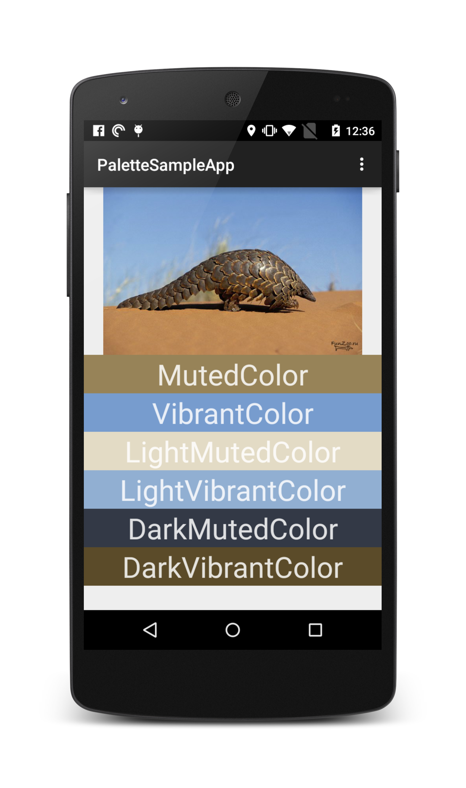
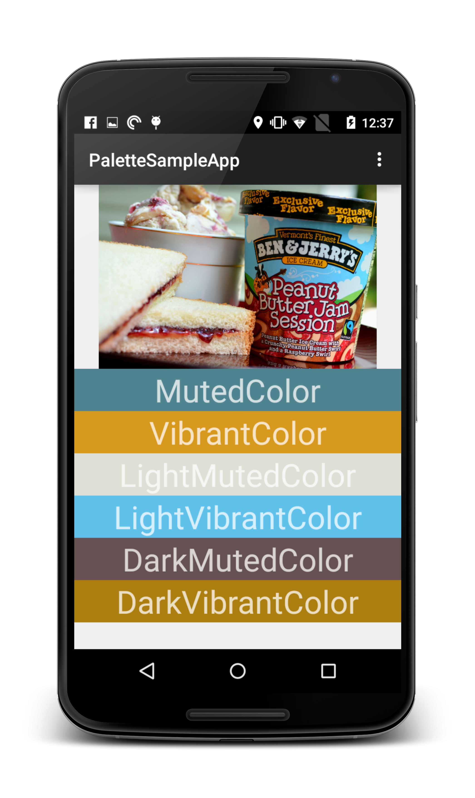
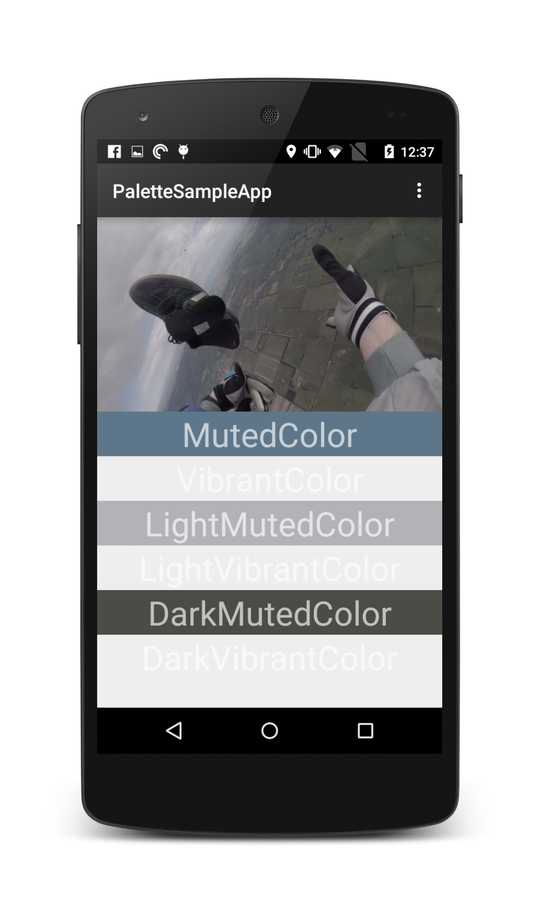

# Palette Sample App

This is an app what loads random images and generates a Palette.
I used it to get a feel witch color i should use.

Screenshots
===========================
| Armadillo     | Ben & Jerrys  | Parachute Jump  |
| ------------- |:-------------:| ---------------:|
||||

How to use this source code
===========================

This project can be opened in Android Studio 1.0 or later. It contains a single module
called **app** in the `app/` folder.

The project can be compiled from the command line using Gradle.

The actual source code and resources can be found in `app/src/main/`. The only dependencies are in `app/lib/`.

## Help or Questions?

Open an hit me up on [Twitter](http://twitter.com/www40).

Source code license
===================

This project is subject to the [Apache License, Version 2.0](http://apache.org/licenses/LICENSE-2.0.html).

THE SOFTWARE IS PROVIDED "AS IS", WITHOUT WARRANTY OF ANY KIND, EXPRESS OR
IMPLIED, INCLUDING BUT NOT LIMITED TO THE WARRANTIES OF MERCHANTABILITY,
FITNESS FOR A PARTICULAR PURPOSE AND NONINFRINGEMENT. IN NO EVENT SHALL THE
AUTHOR BE LIABLE FOR ANY CLAIM, DAMAGES OR OTHER LIABILITY, WHETHER IN AN 
ACTION OF CONTRACT, TORT OR OTHERWISE, ARISING FROM, OUT OF OR IN 
CONNECTION WITH THE SOFTWARE OR THE USE OR OTHER DEALINGS IN THE SOFTWARE.